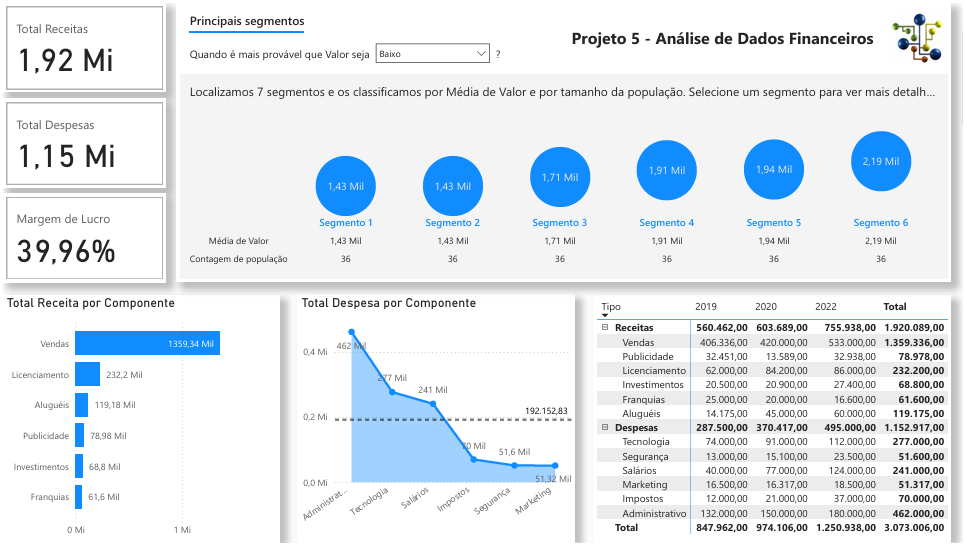

# Projeto 5 - Análise de Dados Financeiros
Projeto do curso: "Microsoft Power BI Para Business Intelligence e Data Science", por [Data Science Academy](www.datascienceacademy.com.br). 

## Entendimento do Negócio
A área de finanças é fundamental para o sucesso de uma empresa, pois é responsável por  gerenciar  os  recursos  financeiros  da  organização  e  garantir  que  esses  recursos  sejam utilizados de forma eficiente e eficaz para alcançar os objetivos da empresa.  

Algumas das principais funções da área de finanças de uma empresa incluem:  

- Planejamento  financeiro:  essa  função  envolve  a  criação  de  um  plano  financeiro estratégico para a empresa, que define como a empresa irá alocar seus recursos financeiros para atingir seus objetivos.
- Controle financeiro: a área de finanças deve monitorar constantemente os fluxos de caixa, as receitas e as despesas da empresa para garantir que ela esteja operando dentro de seu orçamento e prevendo possíveis desvios.
- Gerenciamento de riscos: a área de finanças deve avaliar e gerenciar os riscos financeiros da empresa, como riscos de mercado, de crédito e de liquidez.
- Tomada de decisões financeiras: a área de finanças deve fornecer informações e análises financeiras  para  ajudar  a  empresa  a tomar  decisões  importantes,  como  investir  em  novos projetos, fazer aquisições ou buscar financiamento externo.
- Relacionamento  com  investidores:  a  área  de  finanças  também  é  responsável  por gerenciar o relacionamento com os investidores, divulgando informações financeiras e ajudando a construir a confiança do mercado na empresa.

## Principais KPIs da Área de Logística
- Fluxo de caixa: é uma medida do dinheiro que entra e sai da empresa em um determinado período de tempo. O fluxo de caixa positivo é um sinal de que a empresa está gerando receita suficiente para cobrir suas despesas.
- Margem de lucro: é a porcentagem de lucro que a empresa ganha em cada venda. Ela pode ser calculada dividindo o lucro líquido pela receita total.
- Retorno  sobre  o  investimento  (ROI):  é  uma  medida  do  retorno  que  a  empresa  está obtendo de seus investimentos. O ROI pode ser calculado dividindo o lucro pelo investimento inicial.
- Endividamento: é a medida da quantidade de dívida que a empresa tem em relação ao seu patrimônio líquido. Ele pode ser calculado dividindo a dívida total pelo patrimônio líquido.
- Faturamento:  é  a  receita  total  que  a  empresa  gera  em  um  determinado  período  de tempo.
- Custo de aquisição de clientes (CAC): é a quantidade de dinheiroque a empresa gasta para adquirir cada novo cliente. Ele pode ser calculado dividindo o custo total de marketing e vendas pelo número de novos clientes.
- Prazo médio de pagamento (PMP): é o tempo médio que a empresa leva para pagar seus fornecedores. Ele pode ser calculado dividindo o valor total das compras pelo valor total pago a fornecedores em um determinado período de tempo.

## Desenvolvimento do Projeto

### Entregas para o Negócio
A solução desenvolvida permitirá analisar os seguintes indicadores financeiros:  

- Total de Receitas
- Total de Despesas
- Margem de Lucro
- Total deReceitasPor Componente
- Total deDespesasPor Componenteem relação à média de Despesas
- Total  de  Receitase  DespesasPor  Componente  e  Por  Ano, com  a  hierarquia Tipo/Componente.

### Sobre o Dataset
O dataset utilizado neste projeto contém informações financeiras organizadas por tipo de movimentação, componente financeiro, data e valor. Ele é composto por 432 registros, representando dados financeiros ao longo de diferentes períodos.  

As principais informações disponíveis são:  

- Tipo: classifica a natureza do dado financeiro (ex.: receitas).
- Componente: detalha a origem ou categoria do valor (ex.: vendas).
- Data: data de referência do lançamento financeiro, organizada em base mensal.
- Valor: montante financeiro associado ao período analisado.

### Dicionário de Dados
| Coluna         | Descrição                                                      | Tipo     |
| -------------- | -------------------------------------------------------------- | -------- |
| **Tipo**       | Natureza da movimentação financeira (ex.: Receitas)            | Texto    |
| **Componente** | Origem ou categoria do valor financeiro (ex.: Vendas)          | Texto    |
| **Data**       | Data de referência do registro financeiro (formato DD/MM/AAAA) | Data     |
| **Valor**      | Valor financeiro registrado no período                         | Numérico |

### Dataviz do Projeto
Segue solução proposta, com as respostas solicitadas para a área de negócio.

[End]

### 👍 Meus contatos
- LinkedIn - [renato-malbuquerque](https://www.linkedin.com/in/renato-malbuquerque/)
- GitHub - [renato-albuquerque](https://github.com/renato-albuquerque)
- Discord - [Renato Albuquerque#0025](https://discordapp.com/users/992621595547938837)
- Business Card - [Renato Albuquerque](https://rma-contacts.vercel.app/)
